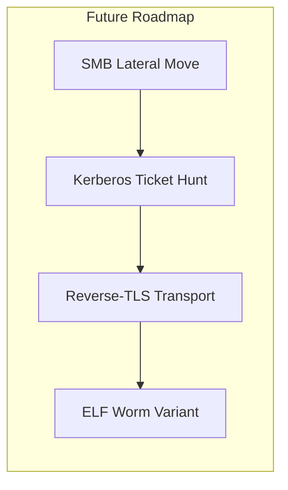

# Self-Propagating Worm

> Collection of scripts **and** a binary agent for automated reconnaissance scanning, SSH/Telnet propagation, and C2 control.

---

## 🚫 Disclaimer  
This repository is provided for **educational purposes only** and intended for **authorized security research**.  
Use of these materials in unauthorized or illegal activities is **strictly prohibited**.

---

## Description  

This project implements a multi-component **self-propagating worm**, consisting of:

| Component | Role |
|-----------|------|
| **`recon.py`** | Reconnaissance module: gathers SSH credentials, scans the network, launches attack plugins |
| **`guid/*.py`** | Technique plugins for remote access over **SSH** and **Telnet** |
| **`agent.go`** | Lightweight C2 agent: deploys on victims, enables peer-to-peer propagation & remote command execution |

**P2P Module**
Maintains a dynamic peer list by listening on a designated TCP port, ingesting neighbor-reported node addresses, and seamlessly merging them into a unified set without duplicates. This ensures the agent always has up-to-date peer endpoints for decentralized communication.

**Tor Fallback**
Provides a resilient C2 channel by first attempting a direct HTTPS POST and, on failure or non-200 response, automatically rerouting the same request through the Tor network via a SOCKS5 proxy. This preserves connectivity and anonymity even when the primary server is unreachable.

---

## Quick Usage

```bash
# 1 – Run network reconnaissance
python recon.py

# 2 – When prompted:
#    • staging directory (default: /tmp/ssh_creds)
#    • any additional credentials
````

The script will automatically:

1. **Collect** SSH private keys & `known_hosts` → save as JSON in the staging dir.
2. **Discover** live hosts in the LAN.
3. For each host, apply the first **successful** technique from `ALL_TECHNIQUES`.

---

## Recon Module — `recon.py`

| Function                               | Purpose                                                                                                                     |
| -------------------------------------- | --------------------------------------------------------------------------------------------------------------------------- |
| **`find_private_keys()`**              | Locate `~/.ssh/id_*` (excluding `.pub`), set `600`, return paths                                                            |
| **`parse_known_hosts()`**              | Parse `~/.ssh/known_hosts`, ignore comments / hashes, return host list                                                      |
| **`copy_to_staging(keys)`**            | Create `/tmp/ssh_creds`, copy keys, return new paths                                                                        |
| **`prepare_ssh_data()`**               | Aggregate keys & hosts → write `/tmp/ssh_creds/ssh_data.json`<br>Returns:<br>`{"keys": [...], "known_hosts": [...]}`        |
| **`discover_hosts()`**                 | Find live hosts via:<br>• mDNS/Bonjour → `dns-sd -B _ssh._tcp`<br>• ARP + ping sweep                                        |
| **`load_creds_db(path="creds.json")`** | Load `(user, password)` pairs from JSON;<br>append key-based creds for current user                                         |
| **`probe_ports(ip)`**                  | Test ports **22, 23, 80, 445** with `nc -z`; return open list                                                               |
| **`main()`**                           | Orchestrates:<br>1 `prepare_ssh_data()` → 2 `load_creds_db()` → 3 `discover_hosts()` → 4 iterate hosts & techniques |

---

## Plugins — `guid/*.py`

All plugins share a **Technique interface**:

```python
def applicable(host) -> bool
def execute(host, creds_db) -> bool
```

| Plugin               | What it does                                                                                                       |
| -------------------- | ------------------------------------------------------------------------------------------------------------------ |
| **`SSHBruteForce`**  | Targets port **22** → tries user/pass combos **&** SSH keys; on success, uploads & runs the payload/agent via SFTP |
| **`TelnetDefaults`** | Targets port **23** → attempts default Telnet creds; on success, transfers the agent in Base64 and executes        |

All are aggregated into **`ALL_TECHNIQUES`** for use by `recon.py`.

---

## Agent — `agent.go`

| Stage                | Behaviour                                                                                                                                                    |
| -------------------- | ------------------------------------------------------------------------------------------------------------------------------------------------------------ |
| **Bootstrap**        | Copy binary → safe dir (macOS `~/Library/Application Support`, Linux `~/.local/bin`, Win `%APPDATA%`)<br>Remove macOS quarantine<br>Relaunch & exit original |
| **Persistence**      | macOS → LaunchAgent plist<br>Linux → systemd user unit<br>Windows → `HKCU\Run` key                                                                           |
| **P2P Listener**     | Default TCP **40444** → exchange peer lists (`savePeers` / `listPeers`)                                                                                      |
| **Main C2 Loop**     | Every **90 s**:<br>• gather host info + peers<br>• POST to CDN endpoint<br>• execute returned commands in parallel                                           |
| **Command Handling** | `self-update` → hot-swap binary<br>`exfil-keys` → collect SSH data<br>`scan-subnet` → built-in port scanner<br>*anything else* → run as shell cmd            |
| **Core**             | Go 1.XX, statically linked (OS + arch: macOS/Linux/Windows, arm/x86)                                                                                         |

---

##  Extensibility

The project is **under active development**—expect new techniques, transports, and evasions.
Feel free to open issues or pull requests!



# Server
The server component receives beacons from Go agents in JSON format, generates unique UUIDs for each, stores and updates host data in a MySQL database, issues pending commands for execution, and marks them as executed. Database connection settings are centralized in a single configuration file, and all operations on the hosts, commands, and executed_commands tables are handled by a wrapper class. A simple web interface allows you to view the list of registered agents and add new commands with an optional OS filter.


# Packer
packer_loader.exe is a self-extracting executable with a built in virtual machine.  
It XOR encrypts any binary payload and bundles it with a loader into a single EXE.  
When run the packed EXE, it automatically decrypts the payload and executes it in the VM.

## Features

- **Pack any binary** into a self extracting EXE.  
- **XOR encryption** of the payload at pack time and automatic decryption at run time.  
- **Built in VM** for a simple stack based bytecode:
  - `PUSH`, `ADD`, `SUB`, `MUL`, `DIV`, `PRINT`, `HALT`  
- **No external dependencies** all code is contained in the EXE.

## Build on Windows / MinGW

1. Place these files in one folder:
   - `vm.h`, `vm.c`  
   - `packer_loader.c`  
   - `Makefile`  

2. Open an MSYS2/MinGW shell and run:
   ```
   make

3. The build produces `packer_loader.exe`.

## Usage

1. **Pack a payload**

   ```sh
   packer_loader.exe pack <input.bin> <output.exe>
   ```

   * `<input.bin>`: payload.
   * `<output.exe>`: name of the self extracting EXE.

2. **Run the packed EXE**

   ```sh
   output.exe
   ```

   At launch, it will:

   1. Read its own file.
   2. Locate the `0xDEADBEEF` marker.
   3. XOR-decrypt the embedded payload.
   4. Execute the payload in the VM.

## Working

```sh
Build: 
make

Pack:
packer_loader.exe pack bytecode.bin packed_vm.exe

Run:
packed_vm.exe
```

## Customization

* **Encryption key**: edit the `key` array in `packer_loader.c`.
* **VM opcodes / stack size**: modify `vm.h`/`vm.c`.
* **Add new instructions**: extend the enum in `vm.h` and handling in `run_vm`.

